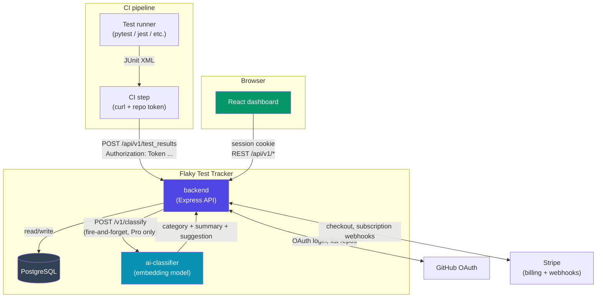
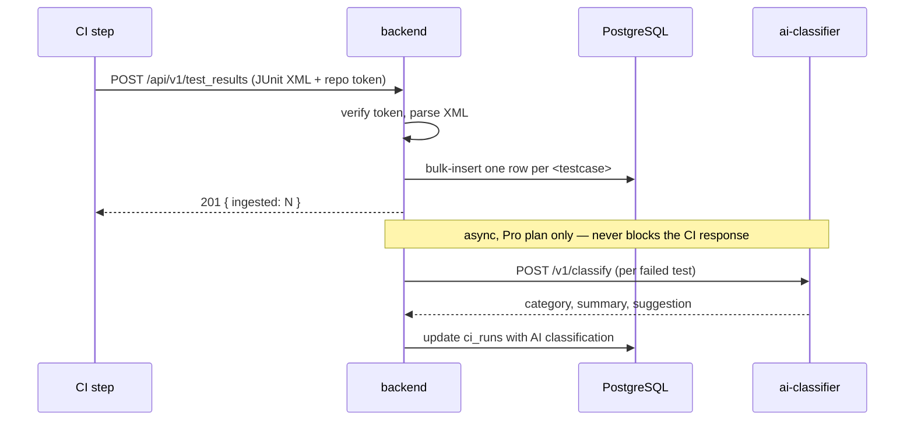

# Flaky Test Tracker

Teams with real test suites eventually get flaky tests — failures that come
and go because of timing, shared state, or network hiccups, not because the
code is actually broken. Engineers lose trust in CI, re-run builds "just in
case", and nobody has clean data on which tests are the actual repeat
offenders.

Flaky Test Tracker ingests JUnit XML from your CI pipeline after every run,
tracks each test's pass/fail history per repo, and surfaces the tests that
alternate between passing and failing — ranked by a flakiness score. Pro
accounts additionally get each failure automatically classified (timing /
network / assertion / environment) with a plain-English summary and a
suggested next step, powered by a local embedding model.

## Architecture

Three independently deployable services:

- **`backend`** — Express + PostgreSQL API. Authenticates users via GitHub
  OAuth, issues per-repo CI tokens, ingests JUnit XML, computes flakiness
  scores, and handles Stripe billing for the Pro plan.
- **`ai-classifier`** — standalone microservice that classifies *why* a test
  failed, using sentence embeddings compared against a handful of example
  phrases per category (no external API key, no per-request network call —
  the model runs in-process). Called by the backend, fire-and-forget, only
  for Pro-plan repos.
- **`frontend`** — React + Vite dashboard where users connect repos, view
  their flakiest tests with AI analysis, manage CI tokens, and manage
  billing.



### Request flow: ingesting a test run



## Repos and tests, not "projects"

A user connects GitHub repos they have CI access to, generates a per-repo
API token from the dashboard, and adds one step to their CI workflow that
posts the JUnit XML results file after tests run. Everything else —
flakiness scoring, AI classification, the dashboard — works off that
ingested history with no further setup.

## Local development

Each service has its own `.env` (see each folder) and runs independently:

```bash
# 1. PostgreSQL (or run your own)
docker run -d -p 5432:5432 -e POSTGRES_PASSWORD=devpassword -e POSTGRES_DB=flaky_test_tracker postgres:16

# 2. backend
cd backend && npm install && npm run db:init && npm run dev   # :3000

# 3. ai-classifier
cd ai-classifier && npm install && npm run dev                # :4100

# 4. frontend
cd frontend && npm install && npm run dev                     # :8000
```

## Deployment

Each service ships with its own `Dockerfile` and is meant to be deployed as
an independent container — e.g. as three separate services on Render, with
Render's managed PostgreSQL as the database. No `docker-compose.yml` is
included on purpose; that wiring lives on the hosting side.

| Service | Port | Depends on |
|---|---|---|
| `backend` | 3000 | PostgreSQL, `ai-classifier` (optional), GitHub OAuth app, Stripe |
| `ai-classifier` | 4100 | — (downloads its embedding model on first request) |
| `frontend` | 80 (nginx) | `backend` |

## Tech stack

- **Backend**: Node.js, TypeScript, Express, Sequelize, PostgreSQL, Passport
  (GitHub OAuth), Stripe, Zod, Multer
- **AI classifier**: Node.js, TypeScript, `@huggingface/transformers`
  (Xenova ONNX models, runs on CPU)
- **Frontend**: React 19, TypeScript, Vite, TanStack Query, Tailwind CSS,
  Radix UI, React Router
